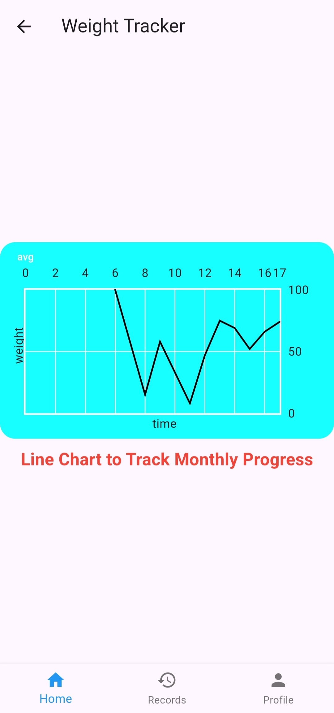

# Weight Tracker

This is a mobile application built using the Flutter framework and Sqflite for Database.

## Features

- **User Login/Signup:** Users can create an account or log in to an existing one.
- **Weight Tracking:** Track your daily weight progress with the help of a line chart.
- **Data Management:** Users can add, edit, and delete weight entries stored in the SQLite database.
- **Responsive Design:** The app's design adapts to different screen sizes, providing a seamless user experience across devices.
- **Beginner Friendly:** The codebase is well-structured and beginner-friendly, making it easy to understand and modify.

## Screens

<!-- Define a grid layout using HTML -->

  <!-- Image 1 -->
  

    
    
Starting Screen

  

  <!-- Image 2 -->
  

    
    
Sign In Screen

  

  

    
    
Sign Up Screen

  

  

    
    
Add/Edit entry dialogue

  

  

    
    
Warning Dialogue

  

  

    
    
Home Screen

  

  

    
    
Records Screen

  

  

    
    
Profile Screen

  

  
  <!-- Add more images here -->

